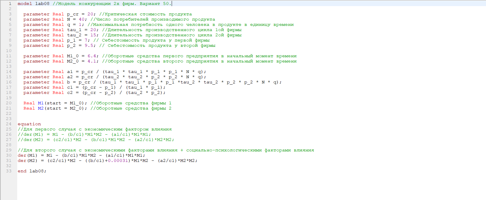
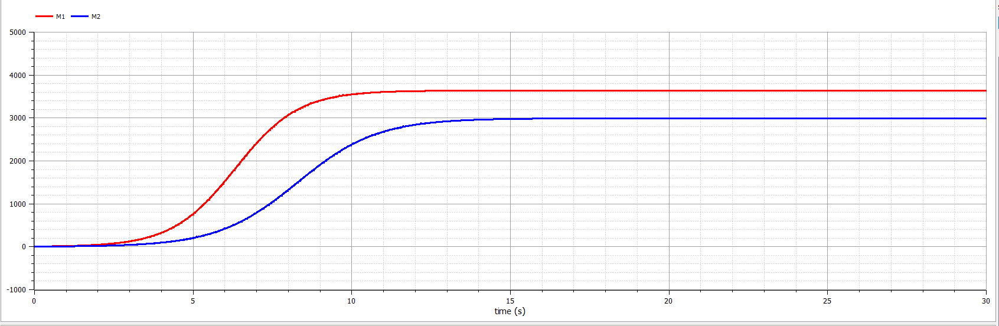
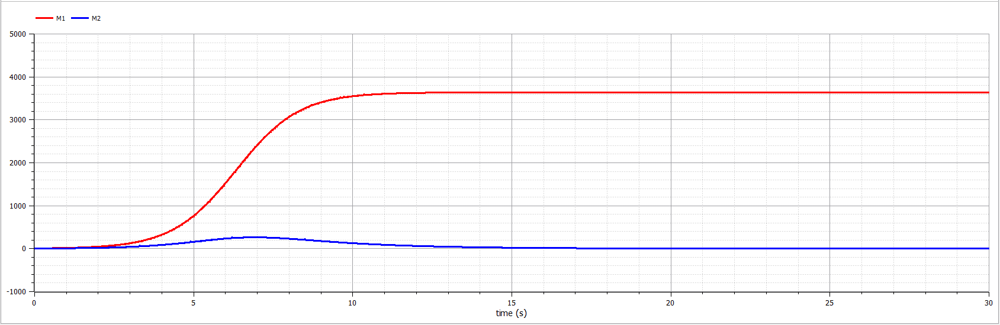

---
# Front matter
lang: ru-RU
title: "Лабораторная работа №8. Вариант 50."
subtitle: "Модель конкуренции"
author: "Силкина Мария Александровна"

# Formatting
toc-title: "Содержание"
toc: true # Table of contents
toc_depth: 2
lof: true # List of figures
lot: true # List of tables
fontsize: 12pt
linestretch: 1.5
papersize: a4paper
documentclass: scrreprt
polyglossia-lang: russian
polyglossia-otherlangs: english
mainfont: PT Serif
romanfont: PT Serif
sansfont: PT Sans
monofont: PT Mono
mainfontoptions: Ligatures=TeX
romanfontoptions: Ligatures=TeX
sansfontoptions: Ligatures=TeX,Scale=MatchLowercase
monofontoptions: Scale=MatchLowercase
indent: true
pdf-engine: lualatex
header-includes:
  - \linepenalty=10 # the penalty added to the badness of each line within a paragraph (no associated penalty node) Increasing the value makes tex try to have fewer lines in the paragraph.
  - \interlinepenalty=0 # value of the penalty (node) added after each line of a paragraph.
  - \hyphenpenalty=50 # the penalty for line breaking at an automatically inserted hyphen
  - \exhyphenpenalty=50 # the penalty for line breaking at an explicit hyphen
  - \binoppenalty=700 # the penalty for breaking a line at a binary operator
  - \relpenalty=500 # the penalty for breaking a line at a relation
  - \clubpenalty=150 # extra penalty for breaking after first line of a paragraph
  - \widowpenalty=150 # extra penalty for breaking before last line of a paragraph
  - \displaywidowpenalty=50 # extra penalty for breaking before last line before a display math
  - \brokenpenalty=100 # extra penalty for page breaking after a hyphenated line
  - \predisplaypenalty=10000 # penalty for breaking before a display
  - \postdisplaypenalty=0 # penalty for breaking after a display
  - \floatingpenalty = 20000 # penalty for splitting an insertion (can only be split footnote in standard LaTeX)
  - \raggedbottom # or \flushbottom
  - \usepackage{float} # keep figures where there are in the text
  - \floatplacement{figure}{H} # keep figures where there are in the text
---

# Цель работы

Изучить модель конкуренции двух фирм. 

# Задачи

1. Постройте графики изменения оборотных средств фирмы 1 и фирмы 2 без учета постоянных издержек и с веденной нормировкой для случая 1.

2. Постройте графики изменения оборотных средств фирмы 1 и фирмы 2 без учета постоянных издержек и с веденной нормировкой для случая 2.

# Теоретическое введение

Модель конкуренции двух фирм для случая, когда нет социально-психологического фактора имеет следующий вид:

$$ \frac{dM_1}{d\theta} = M_1 - \frac{b}{c_1} M_1 M_2 - \frac{a_1}{c_1} M_1^2 $$

$$ \frac{dM_2}{d\theta} = \frac{c_2}{c_1} M_2 - \frac{b}{c_1} M_1 M_2-\frac{a_2}{c_1} M_2^2 $$

где $$ a_1 = \frac{p_{cr}}{{\tau}1^2 p_1^2 N q }, a_2 = \frac{p{cr}}{{\tau}2^2 p_2^2 N q}, b = \frac{p{cr}}{{\tau}_1^2 p_1^2 {\tau}2^2 p_2^2 N q } $$ $$ c_1 = \frac{p{cr} - p_1}{{\tau}1 p_1}, c_2 = \frac{p{cr} - p_2}{{\tau}_2 p_2}$$

N - число потребителей производимого продукта
  
$\tau$ - длительность производственного цикла  

p~cr~ - критическая стоимость продукта 
 
p - себестоимость продукта  

q - максимальная потребность одного человека в продукте в единицу времени  

$\theta=\frac{t}{c_1}$ - безразмерное время.

Для случая когда мы учитываем социально-психологический фактор система принимает следующий вид:

$$ \frac{dM_1}{d\theta} = M_1 - \frac{b}{c_1} M_1 M_2-\frac{a_1}{c_1} M_1^2 $$

$$ \frac{dM_2}{d\theta} = \frac{c_2}{c_1} M_2 - (\frac{b}{c_1} + 0.00031) M_1 M_2-\frac{a_2}{c_1} M_2^2 $$

Значение величин имеет тот же смысл.

# Выполнение лабораторной работы

## Код программы 

Код програмы написан на языке Modelica. 

model lab08 //Модель конкуренции 2х фирм. Вариант 50.

  parameter Real p_cr = 20; //Критическая стоимость продукта

  parameter Real N = 40; //Число потребителей производимого продукта

  parameter Real q = 1; //Максимальная потребность одного человека в продукте в единицу времени

  parameter Real tau_1 = 20; //Длительность производственного цикла 1ой фирмы

  parameter Real tau_2 = 15; //Длительность производственного цикла 2ой фирмы

  parameter Real p_1 = 7; // Себестоимость продукта у первой фирмы

  parameter Real p_2 = 9.5; // Себестоимость продукта у второй фирмы
  
  parameter Real M1_0 = 6.4; //Оборотные средства первого предприятия в начальный момент времени

  parameter Real M2_0 = 4.1; //Оборотные средства второго предприятия в начальный момент времени
  
  parameter Real a1 = p_cr / (tau_1 * tau_1 * p_1 * p_1 * N * q);

  parameter Real a2 = p_cr / (tau_2 * tau_2 * p_2 * p_2 * N * q);

  parameter Real b = p_cr / (tau_1 * tau_1 * p_1 * p_1 *tau_2 * tau_2 * p_2 * p_2 * N * q);

  parameter Real c1 = (p_cr - p_1) / (tau_1 * p_1);

  parameter Real c2 = (p_cr - p_2) / (tau_2 * p_2);
  
  Real M1(start = M1_0); //Оборотные средства фирмы 1

  Real M2(start = M2_0); //Оборотные средства фирмы 2
  

equation

//Для первого случая с экономическим фактором влияния

//der(M1) = M1 - (b/c1)*M1*M2 - (a1/c1)*M1*M1;

//der(M2) = (c2/c1)*M2 - (b/c1)*M1*M2 - (a2/c1)*M2*M2;

//Для второго случая с экономическими факторами влияния + социально-психологическими факторами влияния

der(M1) = M1 - (b/c1)*M1*M2 - (a1/c1)*M1*M1;

der(M2) = (c2/c1)*M2 - ((b/c1)+0.00031)*M1*M2 - (a2/c1)*M2*M2;

end lab08;

## Ход работы

Мною был написан код программы, который выводит графики, нужные в задачах, для двух случаев. (рис 1. -@fig:001)  

{ #fig:001 width=70% }

Ниже приведен график изменения оборотных средств фирм для первого случая, когда отсутствует социально-психологический фактор.(рис 2. -@fig:002)  

{ #fig:002 width=70% }

На следующем рисунке изображен график изменения оборотных средств фирм для первого случая, когда присутствует социально-психологический фактор.  (рис 3. -@fig:003)  

{ #fig:003 width=70% }

# Выводы

При выполнении данной лабораторной работы я изучила модель конкуренции двух фирм при разных случаях.